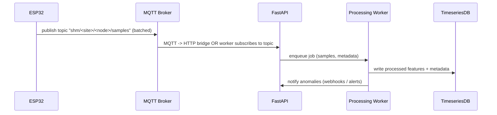
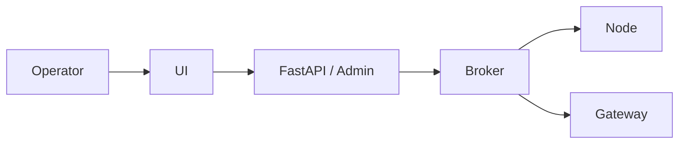

# Structural Health Monitoring (SHM) System

> **Purpose**: A single-file reference describing the end-to-end architecture, data flows, API, deployment and design decisions for the Structural Health Monitoring (SHM) system.

**Stack Overview**: 
- **Backend**: FastAPI
- **Edge nodes**: ESP32 (accelerometers / IMUs)
- **Messaging**: MQTT (edge → broker) + optional direct HTTP to FastAPI for control/ops
- **Storage**: Time-series DB (InfluxDB / ClickHouse / PostgreSQL + Timescale) and object storage for raw files
- **Visualization**: Grafana / custom UI

---

## Table of Contents

1. [Overview](#1-overview)
2. [Components](#2-components)
3. [Data Flows](#3-data-flows)
4. [FastAPI Design](#4-fastapi-design)
5. [Messaging & Topics](#5-messaging--topics)
6. [Data Model & Storage](#6-data-model--storage)
7. [Edge Node Behaviour](#7-edge-node-behaviour)
8. [Processing & Algorithms](#8-processing--algorithms)
9. [Deployment & Scaling](#9-deployment--scaling)
10. [Security & Operational Concerns](#10-security--operational-concerns)
11. [Quickstart (Dev)](#11-quickstart--dev)
12. [References](#12-references)

---

## 1. Overview

**High-level**: Sensors (ESP32 + MEMS accelerometers / IMU) → local gateway / MQTT broker → FastAPI backend for ingestion, control and metadata → timeseries DB + analytics pipeline → visualization / alerting.

```mermaid
flowchart LR
  subgraph Edge
    A[ESP32 Nodes<br/>(ADXL345 / MPU-6050 / IMU)] -->|MQTT / ESP-NOW| B[MQTT Broker]
    A -->|Local HTTP (control)| F[Local Gateway (RPi)]
  end

  B --> C[FastAPI Ingest / Control API]
  F --> C
  C --> D[Processing Pipeline<br/>(workers / Celery / Prefect)]
  D --> E[Timeseries DB (InfluxDB / Timescale)]
  D --> G[Object Storage (raw batches)]
  E --> H[Grafana / UI]
  H --> I[Operators / Engineers]
  C --> J[Auth / Admin Service]
```

---

## 2. Components

### Edge Nodes (ESP32)

**Sensor**: MPU-6050 / ADXL345 or ADXL355 depending on budget and noise requirements.

**Sampling**: 100–200 Hz typical; interrupt-driven sampling with SPI recommended for reliability. ESP32 has demonstrated stable streaming at 100–200 Hz over WiFi/MQTT when batched appropriately.

### Networking / Messaging

**MQTT Broker** (Mosquitto / EMQX / HiveMQ) for low-latency, reliable ingestion. Use QoS=1 for critical telemetry.

**Optionally support** ESP-NOW or PainlessMesh for battery-operated nodes / mesh topologies.

### Gateway / Edge Aggregator (Raspberry Pi recommended)

Runs local broker, buffering, local FFT preprocessing, and acts as the bridge to cloud FastAPI when network unreliable. Offload heavy processing to cluster head if >20 nodes.

### Backend (FastAPI)

Serves ingestion API (HTTP), metadata & config endpoints, device management, health checks and control commands.

Dispatches messages to processing pipeline (Celery / Prefect / task queue).

### Processing Workers

Real-time ingestion → short-term buffering → feature extraction (FFT, wavelets), baseline comparison, ML inference, anomaly scoring. Use Python (NumPy, SciPy, PyWavelets, PyTorch / ONNX for models).

### Storage

**Timeseries DB**: InfluxDB / TimescaleDB for processed metrics and aggregated windows.

**Object storage**: Raw batch files (parquet / compressed binary) for reanalysis.

### Visualization & Alerting

Grafana for time-series dashboards and alerting. Optional custom UI served by FastAPI.

---

## 3. Data Flows

### A. Ingestion & Buffering (edge → backend)



### B. Control Flow (operator → node)



---

## 4. FastAPI Design

> **The backend's responsibility**: device registration, metadata store, ingestion endpoints for processed data & control channels, repository for raw uploads, job dispatching.

### Principal Endpoints (OpenAPI-ready)

#### Device Management

- `POST /api/v1/devices` — Register device (body: `DeviceCreate`)
- `GET /api/v1/devices/{device_id}` — Get device metadata & last-seen
- `PATCH /api/v1/devices/{device_id}/config` — Update sampling config, thresholds

#### Ingest (HTTP fallback)

- `POST /api/v1/ingest/samples`
  - Accepts compressed batch: `{ device_id, start_ts, sample_rate, samples: base64/zlib, format }`
  - Return `{"status":"accepted","job_id":...}`

#### Telemetry / Feature Push (from processing workers)

- `POST /api/v1/metrics` — Push aggregated features (RMS, PSD peaks, freq shifts)

#### Alerts & History

- `GET /api/v1/alerts` — List alerts
- `POST /api/v1/alerts/{alert_id}/ack` — Acknowledge alert

#### Admin / Health

- `GET /api/v1/health` — System status, queue sizes, DB connectivity

### Example Pydantic Models

```python
from pydantic import BaseModel
from typing import List, Optional

class DeviceCreate(BaseModel):
    device_id: str
    site: str
    node_type: str
    sensors: List[str]  # ["mpu6050","adxl345"]
    timezone: Optional[str]

class SamplesIn(BaseModel):
    device_id: str
    start_ts: float  # epoch ms
    sample_rate: int
    samples_base64: str  # compressed float32 triplets
    format: str  # "raw","packed"
```

---

## 5. Messaging & Topics

Use topic structure that is stable and hierarchical:

```
shm/<org>/<site>/<device_id>/samples         # batched raw samples
shm/<org>/<site>/<device_id>/status          # heartbeat, last-seen, battery
shm/<org>/<site>/<device_id>/config          # QOS=1 retained for node configs
shm/<org>/<site>/alerts                      # publishes alerts upstream
```

### Best Practices

**Batching**: Batch 5–10 samples per MQTT message (reduces overhead; recommended by ESP32 streaming practices).

**QoS**: Use QoS=1 for telemetry, retain=true for config topics.

**Offline**: Nodes store to microSD and sync on reconnect (gateway design).

---

## 6. Data Model & Storage

### Raw Samples

Compressed binary blobs stored in object store (parquet / npz) + metadata in DB (start_ts, sample_rate, duration, checksum)

### Processed Features (timeseries)

Fields:
- `site`, `device_id`, `timestamp`
- `rms_x`, `rms_y`, `rms_z`
- `peak_freqs`: list
- `psd_band_energy`
- `kurtosis`, `skewness`
- `temp_compensated`: flag

### Schema Decisions

Timeseries DB (Influx/Timescale) stores features at 1–10s granularity; raw files archived for offline reprocessing. For high node counts (>30), send features rather than raw continuously.

---

## 7. Edge Node Behaviour

### ESP32 Recommended Firmware Design

#### Core Loops

1. **Sensor sampling** (interrupt-driven) → place sample in circular buffer
2. **Batch and compress** (e.g., float32 → int16 scaling or delta-encoding) every batch_size samples. Optionally compute local FFT/feature windows for local alerts
3. **Publish to MQTT** with device_id metadata + timestamp. If offline, write to SD and attempt retry

#### Best Practices

- Use **SPI** for IMU where possible (faster than I2C)
- **Dual-core**: Dedicate one core to acquisition, other to network
- **Time sync**: NTP on gateway or GPS/PPS for microsecond-level sync if ensemble averaging/array methods required

---

## 8. Processing & Algorithms

### Realtime Pipeline

Ingest → buffering → pre-filtering (bandpass) → STFT / FFT windows (Hanning or Hamming depending on resolution) → feature extraction (peak frequencies, spectral entropy, RMS, kurtosis)

### Anomaly Detection

**Baseline model**: Run rolling-window baseline (24–72 hours) to capture seasonal/diurnal effects. Use statistical change detection (Δf > threshold) and ML models (Random Forest or 1D-CNN) for classification. Autoencoder anomaly detector recommended if damage labels are rare.

### Sensor Fusion & Placement

For modal shape and better SNR, place sensors on antinodes/corners (Effective Independence / EI method guidance) — 4–12 accelerometers typically enough for many structures.

### Important Caveats

Consumer MEMS (MPU-6050 / ADXL345) work well for many SHM tasks but have limits: micro-crack detection and very low-amplitude ambient modes (<0.1 mg) may be below their noise floor; design accordingly (arrays, validation with professional sensors if needed).

---

## 9. Deployment & Scaling

### Small Deployment (proof-of-concept)

2–10 nodes → single Raspberry Pi with Mosquitto + FastAPI on a small VM, InfluxDB local. Use direct MQTT → worker.

### Medium Deployment (30–100 nodes)

Use dedicated broker cluster (EMQX / HiveMQ), FastAPI scaled with Uvicorn + Gunicorn behind Nginx, workers in Celery cluster, TimescaleDB / InfluxDB cluster. Partition by site.

### Design Rules

- **Edge aggregation**: Push features when >30 nodes per gateway to reduce raw bandwidth
- Use **load-testing** (simulate batched MQTT messages) before field deployment
- **Retention**: Keep raw for X days (configurable) and features for Y months; raw retention sized based on storage budget

---

## 10. Security & Operational Concerns

- **Auth**: JWT + OAuth2 for API. Mutual TLS for sensitive deployments
- **MQTT**: Enforce username+password, ACLs, and TLS (TLS for brokers across WAN)
- **Network**: Place brokers behind firewalls; use VLANs for sensor networks
- **Data integrity**: Include checksums and sequence numbers inside batches
- **Calibration & validation**: Co-locate at least one professional sensor for validation during commissioning. Consumer MEMS require per-unit calibration for best results

---

## 11. Quickstart — Dev

### Prerequisites

- Python 3.10+, Poetry or pip
- Mosquitto (local) or cloud MQTT
- InfluxDB or Timescale for quick dev (can be local)

### Run Backend Locally

```bash
# Create venv
python -m venv .venv
source .venv/bin/activate
pip install -r requirements.txt  # FastAPI, pydantic, uvicorn, etc.

uvicorn app.main:app --reload --port 8000
# Open http://localhost:8000/docs for OpenAPI
```

### Simulate Node

Use `mqtt-publish` to publish a sample batched payload to `shm/demo/site1/node01/samples`. The ingest worker should pick it up.

---

## 12. References

### Design Sources

- **ESP32 streaming**: Practical recommendations for batching, SPI vs I2C and network behavior
- **Sensor placement**: Effective Independence and sensor-count guidance for SHM deployments
- **Signal processing**: FFT, wavelets and pipeline choices for extracting damage signatures and robust noise separation
- **Consumer MEMS**: Feasibility, limitations, and calibration recommendations
- **Edge/gateway architecture**: Scaling guidance for hybrid edge/cloud split decisions (lessons from SLAM/robotic offload)

---

## Final Notes

This README gives a practical, deployable architecture centered on FastAPI for control + ingestion and MQTT for sensor telemetry. Important system-level tradeoffs are:

- Push raw vs push features
- Local preprocessing vs centralized processing
- Sensor choice (cost vs precision)

The design prioritizes:

- **Reliability** (batched telemetry, QoS=1)
- **Scale** (gateway aggregation)
- **Analyzability** (timeseries + raw archive)

---

**License**: [Your License]  
**Contributors**: [Your Team]  
**Contact**: [Your Contact Info]
